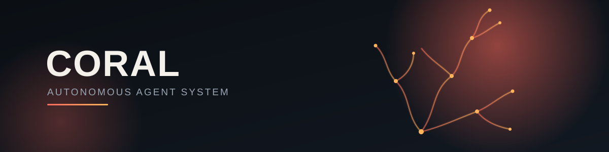
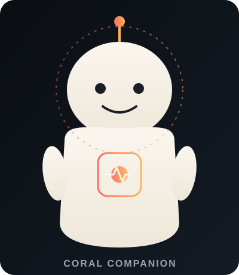

<p align="center">
  
</p>

<p align="center">
  
  
  
  
</p>

<p align="center">
  <em>An autonomous agent runtime built on Claude, with a durable plan lifecycle, execution-safety guardrails, and long-term memory.</em>
</p>

<p align="center">
  <a href="#status">Status</a> ·
  <a href="#what-is-coral">What is Coral</a> ·
  <a href="#architecture">Architecture</a> ·
  <a href="#core-design-principles">Design Principles</a> ·
  <a href="#meet-the-companion">Meet the Companion</a> ·
  <a href="#getting-started">Getting Started</a> ·
  <a href="#roadmap">Roadmap</a>
</p>

<br>

## Status

> 🚧 **Active development — not production-ready.**
>
> Coral has completed the current R0–R3 hardening stages with verification evidence. R4 has completed its initial audit, scope debate, and v1 specification, and is currently **SPEC-READY / awaiting implementation**.
>
> The project is intentionally proceeding phase-by-phase: each stage is audited, scoped, implemented, and verified before the next stage is opened.

<br>

## What is Coral

Coral is an agent runtime that wraps a large language model (Claude, via a local proxy) in a **ReAct execution loop** with the scaffolding a long-running autonomous agent actually needs to be trustworthy:

|                                     |                                                                                                                                                                     |
| ----------------------------------- | ------------------------------------------------------------------------------------------------------------------------------------------------------------------- |
| 🗺️ **Plan lifecycle**              | An explicit, validated state machine — "what is the agent doing right now" is always a well-defined, auditable answer.                                              |
| 📈 **Progress monitor**             | Distinguishes *activity* from *progress* — detects when the agent is running tools without advancing the task, without letting the model grade its own performance. |
| 💾 **Checkpoint & restart safety**  | Crash and interruption recovery are guarded by durable checkpoints and verified recovery paths.                                                                     |
| 🧠 **Consequence memory**           | Recalls what an action led to before, and avoids repeating known failure patterns.                                                                                  |
| 📊 **Dashboard & Telegram control** | Live observability and a conversational control surface.                                                                                                            |
| 🛡️ **Execution governance**        | Hard safety ceilings, cancellation propagation, and global foreground concurrency admission prevent uncontrolled execution.                                         |

<br>

## Architecture

Coral is organized in layers, from the model outward:

```text
Model (LLM)
   ↓
Tool layer            — read/write files, execute commands, HTTP, subprocess management
   ↓
Agent loop (harness)  — ReAct cycle: reason → act → observe, with hard safety ceilings
   ↓
Engine / Orchestrator — multi-session coordination, plan state authority, checkpoint restore
   ↓
Interface             — Telegram bot, dashboard
```

Cutting across all of these is a **persistence layer** — plan state, checkpoints, and memory — the only thing that survives a restart. Getting the boundary between *logical execution* and *durable state* right is a major part of the engineering in this project.

<details>
<summary><strong>Plan state machine</strong></summary>
<br>

Every unit of work Coral does is tracked as a `Plan` with an explicit, validated state machine (`pending → running → completed`, with `stuck`, `paused_limit`, `waiting_user`, `aborted`, and `failed` as recoverable or terminal states).

All transitions go through a single validation gate — nothing is allowed to mutate plan state ad hoc. A single source of truth for "where is this task" is what makes crash recovery, cancellation, and progress monitoring possible without the system contradicting itself.

</details>

<details>
<summary><strong>Progress monitoring</strong></summary>
<br>

A lightweight, deterministic signal — not an LLM self-assessment — that answers "is the agent actually converging on the goal, or just active?"

It combines authoritative plan-item transitions and novelty of recent tool/evidence actions. When neither signal moves for a bounded window, the agent is nudged, then guided to switch strategy, before the plan is surfaced as stuck — never silently looping.

</details>

<details>
<summary><strong>Execution safety</strong></summary>
<br>

Coral enforces hard ceilings on tool-call cycles, propagates cancellation (`AbortSignal`) through the execution stack including spawned subprocesses, and uses durable recovery checkpoints.

The R3 admission layer additionally enforces a **global foreground concurrency ceiling** with immediate rejection at capacity. The current implementation uses `N=4` as the verified test value; this is **not a benchmarked production-capacity value**.

</details>

<br>

## Core design principles

These are enforced, not aspirational:

* **Single source of truth.** Plan state lives in one place, mutated through one validated path. Memory, events, and dashboards read from it — they never become a second authority on task progress.
* **No LLM self-grading of safety-critical signals.** Progress, stagnation, and termination are computed deterministically. The model proposes; the system decides.
* **Identity ≠ Lifecycle ≠ Intent.** Knowing *which* plan/session something is (identity) is different from knowing *what state* it's in (lifecycle), which is different from knowing whether it's still what the user actually wants (intent). Conflating these is a recurring source of bugs this project actively guards against.
* **Evidence over narrative.** Every claim of "this works" is expected to carry reproducible evidence — real output, real commit hashes, real OS-level checks — not a summary asserting success.
* **Scope before implementation.** A phase does not begin implementation until its scope, semantics, acceptance criteria, and verification protocol are explicit.
* **No silent policy changes.** Existing behavior is not treated as product policy merely because it happens to be present in code. Design decisions are explicitly recorded before changing semantics.

<br>

## Verified Hardening Status

| Stage  | Focus                                           | Status                              |
| ------ | ----------------------------------------------- | ----------------------------------- |
| **R0** | Baseline / forensic audit                       | ✅ **VERIFIED**                      |
| **R1** | Execution safety & cancellation lifecycle       | ✅ **VERIFIED**                      |
| **R2** | Crash / interruption recovery                   | ✅ **VERIFIED**                      |
| **R3** | Global foreground concurrency admission         | ✅ **VERIFIED**                      |
| **R4** | Planning loop coherence & single-plan invariant | 🟡 **SPEC-READY — NOT IMPLEMENTED** |

### R3 note

R3 establishes a global foreground admission gate:

* Maximum concurrent foreground requests: configurable.
* Current verified test value: `N=4`.
* Admission at capacity: **immediate REJECT**.
* Rejection is machine-distinguishable through `providerUsed: 'r3-admission'`.
* Counter release is guaranteed through the `finally` lifecycle.
* Background `TaskQueue` remains outside R3 v1.
* Per-user fairness, CPU/RAM-aware admission, and background queue limits are outside scope.

**Important:** `N=4` is a **test value**, not a production capacity claim. Production tuning requires separate benchmarking and product decisions.

### R4 current scope

R4 v1 is intentionally minimal:

* **R4-F.1 — Planning loop coherence**

  * Verified through a controlled/scripted model driving the real engine loop.
  * Focuses on observable lifecycle end states and evidence integrity.
* **R4-F.2 — Single active-plan invariant**

  * Model-independent.
  * Ensures a session cannot create a second active plan.
  * Includes crash/recovery coverage through the existing checkpoint architecture.

Explicitly excluded from R4 v1:

* Model-based planning-quality evaluation.
* Decomposition-quality scoring.
* Automatic enforcement of when a model must create a plan.
* Stuck-recovery interaction behavior.
* Expressive/emotional `BehaviorEngine` integration.
* Per-user concurrency policy.
* Background queue governance.

<br>

## Meet the companion

<table>
<tr>
<td width="220" valign="top">

</td>
<td valign="top">

Coral's dashboard has a companion avatar the team affectionately calls **Baymax** — inspired by the "big, round, gentle robot" archetype rather than any specific reproduction.

It exists to make agent status feel like checking in with a companion, not reading a stack trace: idle, thinking, executing, stuck, done.

The name also became the internal codename for one of the project's hardest bugs — the *"Baymax problem"*: making sure a long-running task survives a restart correctly, without confusing a plan that's merely persisted with a plan that's still actually current.

If you see "Baymax" referenced in ADRs or commit history, that's what it's about.

</td>
</tr>
</table>

<br>

## Getting Started

> Setup instructions are being finalized alongside the remaining hardening work. This section will be filled in once the runtime is stable enough for external use.

<br>

## Roadmap

Coral currently tracks its hardening work through **R0–R4**. Future stages are intentionally not enumerated here until their scope and requirements have been formally audited.

| Stage      | Focus                                           | Status           |
| ---------- | ----------------------------------------------- | ---------------- |
| **R0**     | Baseline / forensic audit                       | ✅ Verified       |
| **R1**     | Execution safety & cancellation lifecycle       | ✅ Verified       |
| **R2**     | Crash / interruption recovery                   | ✅ Verified       |
| **R3**     | Global foreground concurrency admission         | ✅ Verified       |
| **R4**     | Planning loop coherence & single-plan invariant | 🟡 Spec-ready    |
| **Future** | Additional hardening stages                     | ⏳ Not yet scoped |

This roadmap deliberately avoids presenting unscoped future phases as committed requirements.

<br>

## Evidence & Engineering Process

Coral's hardening process follows a strict lifecycle:

```text
INITIAL AUDIT
     ↓
SCOPE / SEMANTICS DEBATE
     ↓
SPECIFICATION
     ↓
IMPLEMENTATION
     ↓
NARROW VERIFICATION
     ↓
EVIDENCE
     ↓
VERIFIED
     ↓
Next phase
```

A phase is not considered verified merely because its implementation exists or most tests pass.

The project distinguishes between:

* **Implementation complete** — code exists.
* **Test passing** — specified tests pass.
* **Verified** — acceptance criteria have reproducible evidence.
* **Production-ready** — capacity, operational behavior, and deployment requirements have additionally been established.

This distinction is intentional.

<br>

## License

*TBD.*

---

<p align="center">
  <sub>Built with Claude · governed by internal architecture decision records (ADRs)</sub>
</p>
